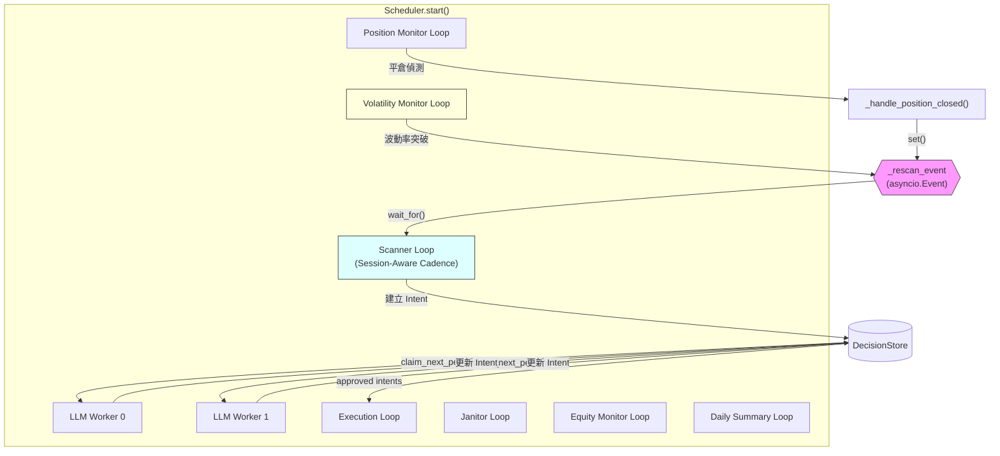
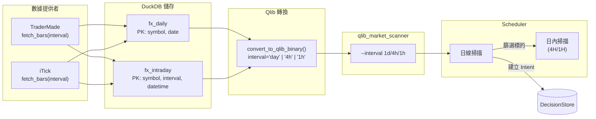
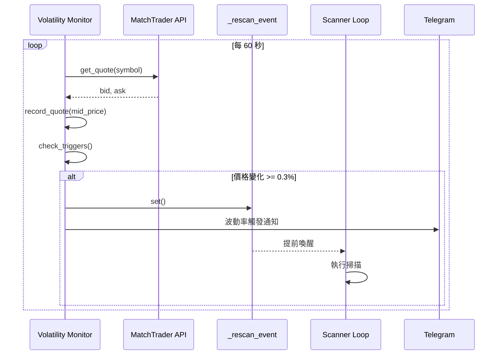

# PropFirmPilot v1.2.0 — 排程優化版本報告

> **報告日期**: 2026-03-02  
> **版本**: v1.2.0（排程優化）  
> **基準版本**: v1.1.0（`6d37b8b`，Weekend Market Closure + Dynamic Drawdown HWM）  
> **聚焦範圍**: Scheduler 決策頻率全面優化 — 平行處理、事件驅動、時段感知、多時間框架、波動率觸發、DST 自動適配、Scanner 修復

---

## 目錄

1. [版本摘要](#1-版本摘要)
2. [版本資訊](#2-版本資訊)
3. [功能總覽](#3-功能總覽)
4. [功能詳述](#4-功能詳述)
5. [架構圖](#5-架構圖)
6. [組態參考](#6-組態參考)
7. [YAML 設定範例](#7-yaml-設定範例)
8. [修改檔案清單](#8-修改檔案清單)
9. [Commit 記錄](#9-commit-記錄)
10. [測試覆蓋](#10-測試覆蓋)
11. [已知限制與未來工作](#11-已知限制與未來工作)
12. [相依性變更](#12-相依性變更)

---

## 1. 版本摘要

v1.2.0 針對 Scheduler 的**決策頻率**進行全面優化。v1.1.0 的排程器以固定 4 小時為間隔執行掃描，不分交易時段、不感知市場波動、不回應倉位變化。此版本引入 8 項改進，使系統能夠：

- **更快回應**：平倉後立即觸發重新掃描，不再等待下一週期
- **更聰明排程**：在倫敦/紐約活躍時段加密掃描（1 小時），離峰時段放寬（4 小時）
- **更敏銳捕捉**：波動率突破閾值時自動觸發提前掃描
- **更深入分析**：日線定方向 + 短週期（4H/1H）確認進場時機
- **更高吞吐**：LLM Worker 預設 2 個平行處理，重新評估間隔由 4 小時縮短至 2 小時
- **夏令時自動適配**：市場開收市和時段邊界自動隨 DST 轉換調整
- **Scanner 信號修復**：信號日期篩選 + XAUUSD 移除，確保每日獲得最新量化信號

所有新功能均為**可選配置**，預設關閉（除 LLM Worker 數量和重新評估間隔外），確保向下相容。

---

## 2. 版本資訊

| 項目 | 值 |
|---|---|
| 版本號 | v1.2.0 |
| 發佈日期 | 2026-03-02 |
| 基準版本 | v1.1.0（`6d37b8b`） |
| 最終 Commit | `ee2afd1` |
| 合併方式 | Fast-forward merge to `main` |
| 變更檔案 | 51 files |
| 新增行數 | +2,575 |
| 刪除行數 | -309 |
| 淨增行數 | +2,266 |
| 測試結果 | 697 passed, 1 pre-existing failure |
| 涉及 Repo | prop-firm-pilot（主）+ qlib_market_scanner（輔） |

---

## 3. 功能總覽

| # | 功能 | 類型 | 預設狀態 | 新模組 |
|---|---|---|---|---|
| 1 | LLM Worker 平行處理 | 參數調整 | 啟用（預設 2） | -- |
| 2 | 平倉後事件驅動重新掃描 | 核心機制 | 永遠啟用 | -- |
| 3 | 時段感知掃描節奏 | 新功能 | 預設關閉 | `session_cadence.py` |
| 4 | 縮短重新評估間隔 | 參數調整 | 啟用（預設 2h） | -- |
| 5 | 多時間框架分析 | 新功能 | 預設關閉 | 跨多模組 |
| 6 | 波動率觸發掃描 | 新功能 | 預設關閉 | `volatility_monitor.py` |
| 7 | Scanner 信號日期篩選 + XAUUSD 移除 | Bug 修復 | 永遠啟用 | -- |
| 8 | DST 自動適配（夏令時） | 新功能 | 預設關閉 | `dst_utils.py` |
---

## 4. 功能詳述

### 4.1 LLM Worker 平行處理

**問題**：v1.1.0 預設僅啟動 1 個 LLM Worker，當多個 Trade Intent 同時等待評估時，只能逐一處理，形成瓶頸。

**方案**：將 `SchedulerConfig.llm_worker_count` 預設值由 1 調整為 2。`Scheduler.start()` 已支援根據此數值動態產生多個 `_llm_worker_loop` 協程，無需額外程式碼變更。

**影響**：
- 2 個 Intent 可同時進行 LLM 評估，減少排隊延遲
- 對 LLM API 的並發請求數增加，需注意 rate limit
- 可透過 YAML 設定調整為更高數值（視 LLM 提供商允許的並發數而定）

**組態**：`scheduler.llm_worker_count: 2`

---

### 4.2 平倉後事件驅動重新掃描

**問題**：當倉位因觸及 SL/TP 而平倉時，系統空出了一個交易槽位。但在 v1.1.0 中，Scanner Loop 以固定間隔（4 小時）輪詢，平倉後最多需等待 4 小時才會啟動新一輪掃描。

**方案**：引入 `asyncio.Event` 作為跨迴圈通訊機制。

- `_handle_position_closed()` 在處理完平倉邏輯後，呼叫 `self._rescan_event.set()`
- `_scanner_loop()` 的等待機制由 `asyncio.sleep()` 改為 `asyncio.wait_for(self._rescan_event.wait(), timeout=scan_interval)`
- 若在等待期間收到 rescan event，立即清除事件並提前執行掃描
- 若超時（正常間隔到期），則照常執行排定的掃描

**影響**：
- 平倉後幾乎立即觸發新一輪掃描，最大化槽位利用率
- 此機制同時被**波動率觸發掃描**（功能 6）共用，形成統一的「提前掃描」信號通道

**實作位置**：`src/scheduler/scheduler.py`（`__init__`、`_handle_position_closed`、`_scanner_loop`）

---

### 4.3 時段感知掃描節奏（Session-Aware Cadence）

**問題**：FX 市場在不同交易時段具有截然不同的流動性特徵。倫敦和紐約時段是主要價格波動來源，而亞洲離峰時段波動較低。以固定 4 小時間隔掃描，在活躍時段可能錯失機會，在離峰時段又浪費資源。

**方案**：新增 `SessionCadence` 類別，根據當前 UTC 時間判斷所處交易時段，動態調整 Scanner Loop 的掃描間隔。

**交易時段定義**：

| 時段 | UTC 時間 | 預設掃描間隔 |
|---|---|---|
| 倫敦 | 07:00 - 16:00 | 1 小時 |
| 紐約 | 12:00 - 21:00 | 1 小時 |
| 倫敦/紐約重疊 | 12:00 - 16:00 | 1 小時 |
| 離峰（亞洲等） | 其餘時間 | 4 小時 |

**核心類別**：

```python
class SessionCadence:
    def is_active_session(self, now: datetime) -> bool
    def get_scanner_interval(self, now: datetime) -> int
    def current_session_name(self, now: datetime) -> str
```

- `is_active_session()`：判斷是否處於倫敦或紐約時段
- `get_scanner_interval()`：若 `session_aware_enabled=False` 則回傳固定 `scanner_interval_seconds`；否則根據時段回傳 `active_session_interval_seconds` 或 `quiet_session_interval_seconds`
- `current_session_name()`：回傳人類可讀的時段名稱，用於日誌

**新增檔案**：`src/scheduler/session_cadence.py`（69 行）

**組態**：

| 參數 | 預設值 | 說明 |
|---|---|---|
| `session_aware_enabled` | `false` | 啟用時段感知 |
| `active_session_interval_seconds` | `3600` | 活躍時段掃描間隔（1h） |
| `quiet_session_interval_seconds` | `14400` | 離峰時段掃描間隔（4h） |
| `london_open_utc` | `7` | 倫敦開市（UTC 小時） |
| `london_close_utc` | `16` | 倫敦收市（UTC 小時） |
| `ny_open_utc` | `12` | 紐約開市（UTC 小時） |
| `ny_close_utc` | `21` | 紐約收市（UTC 小時） |

---

### 4.4 縮短重新評估間隔

**問題**：v1.1.0 對已開倉位的 LLM 重新評估間隔為 4 小時（`reeval_interval_seconds = 14400`）。當市場快速變化時，4 小時的反應時間可能過慢。

**方案**：將 `reeval_interval_seconds` 預設值由 14400（4h）調整為 7200（2h）。

**影響**：
- 每個開倉位每 2 小時被 LLM 重新評估一次（首次評估仍需等待 `reeval_min_hold_seconds` = 1h）
- 增加約 2 倍的 LLM 重新評估頻率
- 結合功能 1（2 個 LLM Worker），可有效消化增加的評估負載

**組態**：`scheduler.reeval_interval_seconds: 7200`

---

### 4.5 多時間框架分析（Multi-Timeframe Analysis）

此為 v1.2.0 最大的功能，涉及完整的數據管線改造，跨越兩個 Repository。

#### 4.5.1 設計理念

傳統的單一時間框架掃描存在一個根本問題：日線掃描能識別趨勢方向，但無法精確定位進場時機。v1.2.0 引入「日線定方向、短週期定進場」的多時間框架策略：

1. **日線掃描**（現有流程）：識別哪些貨幣對值得交易、方向為何
2. **短週期掃描**（新增）：在日線篩選出的標的上，用 4H 或 1H 數據確認進場時機是否合適

#### 4.5.2 數據提供者層（Data Providers）

**檔案**：`src/data/fx_data_fetcher.py`（+120 行）

在 `FxDataProvider` 抽象基類中新增 `fetch_bars()` 方法：

```python
@abc.abstractmethod
async def fetch_bars(
    self, symbol: str, start_date: date, end_date: date,
    client: httpx.AsyncClient, interval: str = "daily",
) -> pd.DataFrame
```

**TraderMade 實作**：
- 支援間隔：`daily`、`4H`、`1H`、`30min`、`15min`、`5min`、`1min`
- 透過 `INTERVAL_MAP` 對映至 API 參數
- `fetch_daily_bars()` 委派至 `fetch_bars(interval="daily")`

**iTick 實作**：
- 透過 `kType` 參數對映：1=1min, 2=5min, 3=15min, 4=30min, 5=1h, 6=4h, 7=8h, 8=daily
- 修復既有的分頁迴圈邊界問題：`while current_start < end_date` 改為 `<=`，避免跳過同日區間
- 修復 iTick 日期篩選問題：`pd.Timestamp(end_date)` 在 `end_date` 為 `date` 型別時轉為午夜零時，導致日內 bar 被過濾。修正為 `end_date + 1 day - 1 second`

#### 4.5.3 DuckDB 儲存層

**檔案**：`src/data/fx_duckdb_store.py`（+162 行）

新增 `fx_intraday` 資料表，與既有 `fx_daily` 分離：

```sql
CREATE TABLE IF NOT EXISTS fx_intraday (
    symbol      VARCHAR NOT NULL,
    interval    VARCHAR NOT NULL,
    datetime    TIMESTAMP NOT NULL,
    open        DOUBLE NOT NULL,
    high        DOUBLE NOT NULL,
    low         DOUBLE NOT NULL,
    close       DOUBLE NOT NULL,
    volume      BIGINT DEFAULT 0,
    provider    VARCHAR DEFAULT 'unknown',
    fetched_at  TIMESTAMP DEFAULT CURRENT_TIMESTAMP,
    PRIMARY KEY (symbol, interval, datetime)
)
```

**新增方法**：
- `upsert_intraday(symbol, df, interval, provider)` — 以 symbol + interval + datetime 範圍做 DELETE + INSERT 交易式 upsert
- `read_intraday(symbol, interval, start_date, end_date)` — 讀取指定間隔的日內數據

#### 4.5.4 Qlib 二進位轉換層

**檔案**：`src/data/fx_to_qlib.py`（+46 行）

`convert_to_qlib_binary()` 新增 `interval` 參數：

| interval 值 | 檔案後綴 | 時間戳格式 | 時間戳處理 |
|---|---|---|---|
| `"day"` | `.day.bin` / `.day.meta` | `%Y-%m-%d` | `dt.normalize()` 正規化至日期 |
| `"4h"` | `.4h.bin` / `.4h.meta` | `%Y-%m-%d %H:%M:%S` | 保留完整時間戳 |
| `"1h"` | `.1h.bin` / `.1h.meta` | `%Y-%m-%d %H:%M:%S` | 保留完整時間戳 |

#### 4.5.5 Scanner Bridge

**檔案**：`src/signal/scanner_bridge.py`（+3 行）

`run_pipeline()` 新增 `interval` 參數（預設 `"1d"`），傳遞 `--interval` CLI 參數至 qlib_market_scanner 子程序。

#### 4.5.6 qlib_market_scanner（輔助 Repo）

**Repo**：`qlib_market_scanner`

- `src/main.py`：新增 `--interval` CLI 參數，對映至 Qlib freq 代碼（`1d`→`day`、`4h`→`4h`、`1h`→`1h`）
- `src/config.py`：新增 freq 對映表供日內 interval 使用
- `tests/test_config.py`：11 筆新測試

#### 4.5.7 Scheduler 整合

**檔案**：`src/scheduler/scheduler.py`

新增 `_run_intraday_scan()` 方法。當 `multi_timeframe_enabled = true` 時，Scanner Loop 在日線掃描建立 Intent 後，會對被篩選出的標的執行一輪短週期掃描：

```
日線掃描 → 建立 Trade Intents → 日內掃描（4H/1H）→ 記錄結果
```

目前日內掃描結果以日誌記錄為主，用於觀察和驗證。後續版本將實現信心度加權融合（Phase 2）。

**組態**：

| 參數 | 預設值 | 說明 |
|---|---|---|
| `multi_timeframe_enabled` | `false` | 啟用多時間框架分析 |
| `entry_timeframe` | `"4h"` | 進場確認使用的短週期（`4h` 或 `1h`） |
| `intraday_lookback_days` | `90` | 日內數據回溯天數 |

---

### 4.6 波動率觸發掃描（Volatility-Triggered Scans）

**問題**：即使啟用了時段感知掃描（功能 3），在排定掃描之間仍可能發生重大市場波動。例如非農數據公佈瞬間，價格劇烈波動但距離下一次掃描還有 30 分鐘。

**方案**：新增 `VolatilityMonitor` 類別，作為獨立的 async 監控迴圈運行。透過 MatchTrader 的 `get_quote()` API 持續輪詢報價，計算滾動視窗內的價格變化百分比。當任一貨幣對突破閾值時，設定 `_rescan_event` 觸發 Scanner Loop 提前掃描。

**核心類別**：

```python
class VolatilityMonitor:
    def record_quote(self, symbol: str, mid_price: float, now: datetime) -> None
    def check_triggers(self, now: datetime) -> tuple[bool, str, float]
    def reset(self) -> None
```

**運作流程**：

1. `_volatility_monitor_loop()` 每 60 秒（可設定）輪詢一次所有追蹤的貨幣對報價
2. 計算 mid price = (bid + ask) / 2，記錄至 per-symbol 的 deque 歷史
3. `check_triggers()` 計算滾動視窗（預設 30 分鐘）內的價格變化百分比
4. 若最大變化超過閾值（預設 0.3%），設定 `_rescan_event` 並發送 Telegram 通知
5. 觸發後進入冷卻期（預設 15 分鐘），避免連續觸發

**記憶體管理**：自動清除超過 2 倍視窗時間的舊報價（`_prune_old_quotes`）。市場休市時可呼叫 `reset()` 清除所有歷史。

**新增檔案**：`src/scheduler/volatility_monitor.py`（119 行）

**組態**：

| 參數 | 預設值 | 說明 |
|---|---|---|
| `volatility_trigger_enabled` | `false` | 啟用波動率觸發 |
| `volatility_threshold_pct` | `0.3` | 觸發閾值（0.3 = 0.3%） |
| `volatility_window_minutes` | `30` | 滾動計算視窗（分鐘） |
| `volatility_poll_interval_seconds` | `60` | 報價輪詢間隔（秒） |
| `volatility_cooldown_seconds` | `900` | 觸發冷卻期（秒，15 分鐘） |

---

---

### 4.7 Scanner 信號日期篩選 + XAUUSD 移除

**問題**：v1.2.0 初期部署後發現 Scanner 信號每天完全相同。根本原因有三：

1. **`ScannerBridge.load_signals_from_file()` 未篩選日期**：載入 `signals.csv` 時返回所有歷史資料（~4,975 行、995 天 × 5 符號），而非僅返回當天或最新日期的信號
2. **XAUUSD 無法取得數據**：AlphaVantage FX_DAILY API 不支援黃金（XAUUSD），導致每次管線執行皆產生錯誤
3. **MockFetcher fallback 靜默啟用**：當真實 API 失敗時，系統靜默回退至 Mock 數據而無任何警告

**方案**：

- `ScannerBridge.load_signals_from_file()` 新增 `target_date` 參數，僅返回該日期的信號；若當日無數據則 fallback 至最新可用日期並記錄警告
- `run_pipeline()` 將 `date` 參數傳遞至 `load_signals_from_file()`
- 從所有 config YAML 移除 XAUUSD（`default.yaml`、`e8_one_5k_challenge.yaml`、`e8_signature_50k.yaml`、`e8_trial_5k.yaml`）
- 移除 `decision_formatter.py` 中 XAUUSD 的 SL/TP 預設值

**影響**：
- 每次掃描只處理當日最新信號（預期 4 行 vs 原來 ~4,975 行）
- 消除 XAUUSD 相關的 API 錯誤，節省 AlphaVantage 日配額（25 次/天）
- 信號現在每日有變化，已在 prod 驗證確認

**實作位置**：`src/signal/scanner_bridge.py`、`config/*.yaml`、`src/decision/decision_formatter.py`

---

### 4.8 DST 自動適配（夏令時自動處理）

**問題**：v1.2.0 的時段感知功能（功能 3）和市場開收市時間均以 UTC 固定小時設定，不自動處理夏令時（DST）切換。歐洲 DST（3月最後一個週日 → 10月最後一個週日）和美國 DST（3月第二個週日 → 11月第一個週日）的切換日期不同，每年有約 3-4 週的偏差窗口。

**方案**：新增 `src/scheduler/dst_utils.py` 模組，使用 Python 標準庫 `zoneinfo`（Python 3.9+）進行時區感知的 DST 偵測。

**核心設計**：

- YAML 配置存儲「冬令時基準」的 UTC 小時（例如 E8 收市 22:00 UTC）
- 當 `dst_auto` / `session_dst_auto` 啟用時，執行時自動偵測 DST 狀態並調整小時
- 夏令時時，UTC 小時向前移動（例如 22:00 → 21:00，因為雅典 DST +1h）

**時區對應**：

| 用途 | 時區 | 冬令 UTC | 夏令 UTC |
|---|---|---|---|
| E8 伺服器 | `Europe/Athens` | UTC+2 | UTC+3 |
| 倫敦時段 | `Europe/London` | UTC+0 | UTC+1 (BST) |
| 紐約時段 | `America/New_York` | UTC-5 (EST) | UTC-4 (EDT) |

**核心函數**：

```python
def dst_adjust_hour(base_utc_hour: int, tz_name: str, at_utc: datetime) -> int:
    """冬令時: 返回 base_utc_hour 不變。夏令時: 向前移動 DST offset 小時。"""

def is_dst_active(tz_name: str, at_utc: datetime) -> bool:
    """判斷指定時區是否處於夏令時。"""

def get_session_hours_utc(
    open_hour: int, close_hour: int, tz_name: str, at_utc: datetime, dst_auto: bool
) -> tuple[int, int]:
    """返回 DST 調整後的開/收市 UTC 小時。"""
```

**新增配置欄位**：

| 範疇 | 參數 | 預設值 | 說明 |
|---|---|---|---|
| `MarketHoursConfig` | `dst_auto` | `false` | 啟用市場開收市 DST 自動調整 |
| `MarketHoursConfig` | `server_timezone` | `"Europe/Athens"` | E8 伺服器時區 |
| `SchedulerConfig` | `session_dst_auto` | `false` | 啟用時段邊界 DST 自動調整 |
| `SchedulerConfig` | `london_timezone` | `"Europe/London"` | 倫敦時段時區 |
| `SchedulerConfig` | `ny_timezone` | `"America/New_York"` | 紐約時段時區 |

**影響**：
- E8 市場開收市時間每年 DST 轉換時自動調整，無需手動修改 YAML
- 倫敦/紐約時段邊界自動隨 DST 移動，確保掃描頻率與真實市場活躍度一致
- 歐洲/美國 DST 不同步的 3-4 週窗口會被正確處理
- 預設關閉，向下相容 — 只在 `dst_auto: true` / `session_dst_auto: true` 時啟動

**新增檔案**：`src/scheduler/dst_utils.py`（175 行）

**測試覆蓋**：45 個 DST 專屬測試（`TestDSTUtils`、`TestMarketHoursCheckerDST`、`TestSessionCadenceDST`）

## 5. 架構圖

### 5.1 Scheduler 非同步迴圈總覽



### 5.2 多時間框架數據管線



### 5.3 波動率觸發流程



---

## 6. 組態參考

v1.2.0 在 `SchedulerConfig` 和 `MarketHoursConfig` 中新增以下欄位：

| 參數 | 型別 | 預設值 | 說明 |
|---|---|---|---|
| `llm_worker_count` | `int` | `2` | LLM 平行 Worker 數量（v1.1.0 預設為 1） |
| `reeval_interval_seconds` | `int` | `7200` | 重新評估間隔（v1.1.0 預設為 14400） |
| `session_aware_enabled` | `bool` | `false` | 啟用時段感知掃描節奏 |
| `active_session_interval_seconds` | `int` | `3600` | 活躍時段掃描間隔 |
| `quiet_session_interval_seconds` | `int` | `14400` | 離峰時段掃描間隔 |
| `london_open_utc` | `int` | `7` | 倫敦開市 UTC 小時 |
| `london_close_utc` | `int` | `16` | 倫敦收市 UTC 小時 |
| `ny_open_utc` | `int` | `12` | 紐約開市 UTC 小時 |
| `ny_close_utc` | `int` | `21` | 紐約收市 UTC 小時 |
| `volatility_trigger_enabled` | `bool` | `false` | 啟用波動率觸發掃描 |
| `volatility_threshold_pct` | `float` | `0.3` | 觸發閾值百分比 |
| `volatility_window_minutes` | `int` | `30` | 滾動計算視窗（分鐘） |
| `volatility_poll_interval_seconds` | `int` | `60` | 報價輪詢間隔（秒） |
| `volatility_cooldown_seconds` | `int` | `900` | 觸發冷卻期（秒） |
| `multi_timeframe_enabled` | `bool` | `false` | 啟用多時間框架分析 |
| `entry_timeframe` | `str` | `"4h"` | 進場確認時間框架 |
| `intraday_lookback_days` | `int` | `90` | 日內數據回溯天數 |
| `session_dst_auto` | `bool` | `false` | 啟用時段邊界 DST 自動調整 |
| `london_timezone` | `str` | `"Europe/London"` | 倫敦時段時區（DST 偵測用） |
| `ny_timezone` | `str` | `"America/New_York"` | 紐約時段時區（DST 偵測用） |

v1.2.0 在 `MarketHoursConfig` 中新增以下欄位：

| 參數 | 型別 | 預設值 | 說明 |
|---|---|---|---|
| `dst_auto` | `bool` | `false` | 啟用市場開收市 DST 自動調整 |
| `server_timezone` | `str` | `"Europe/Athens"` | E8 伺服器時區（DST 偵測用） |

---

## 7. YAML 設定範例

以下為 `config/e8_one_5k_challenge.yaml` 中 v1.2.0 的排程設定：

```yaml
scheduler:
  market_hours:
    enabled: true
    close_day: "Friday"
    close_time_utc: "22:00"    # 17:00 EST
    open_day: "Sunday"
    open_time_utc: "22:00"     # 17:00 EST
    force_close_before_weekend: false
    force_close_minutes_before: 15
    # v1.2.0+: DST 自動適配
    dst_auto: true
    server_timezone: "Europe/Athens"

  # v1.2.0: 時段感知掃描節奏
  session_aware_enabled: true
  active_session_interval_seconds: 3600   # 倫敦/紐約時段 1 小時
  quiet_session_interval_seconds: 14400   # 離峰時段 4 小時

  # v1.2.0: 波動率觸發掃描
  volatility_trigger_enabled: true
  volatility_threshold_pct: 0.3           # 0.3% 價格變化觸發
  volatility_window_minutes: 30
  volatility_cooldown_seconds: 900        # 15 分鐘冷卻

  # v1.2.0: 多時間框架分析（先停用，驗證日內數據後再啟用）
  multi_timeframe_enabled: false
  entry_timeframe: "4h"
  intraday_lookback_days: 90

  # v1.2.0+: DST 自動適配（時段邊界）
  session_dst_auto: true
  london_timezone: "Europe/London"
  ny_timezone: "America/New_York"
```

---

## 8. 修改檔案清單

### 8.1 新增檔案（15 個）

| 檔案 | 行數 | 說明 |
|---|---|---|
| `src/scheduler/session_cadence.py` | 69 | 時段感知掃描間隔計算器 |
| `src/scheduler/volatility_monitor.py` | 119 | 波動率偵測與觸發器 |
| `tests/test_config.py` | 26 | SchedulerConfig 預設值測試 |
| `tests/test_fx_data_fetcher.py` | 206 | TraderMade/iTick fetch_bars() 測試 |
| `tests/test_fx_duckdb_store.py` | 136 | fx_intraday 表測試 |
| `tests/test_fx_to_qlib.py` | 95 | Qlib 二進位轉換多間隔測試 |
| `tests/test_scheduler_multi_timeframe.py` | 102 | 多時間框架整合測試 |
| `tests/test_scheduler_rescan_event.py` | 72 | rescan event 機制測試 |
| `tests/test_scheduler_session_integration.py` | 23 | Scanner Loop 時段感知整合測試 |
| `tests/test_scheduler_volatility_integration.py` | 42 | 波動率監控整合測試 |
| `tests/test_session_cadence.py` | 84 | SessionCadence 單元測試 |
| `tests/test_volatility_monitor.py` | 135 | VolatilityMonitor 單元測試 |
| `src/scheduler/dst_utils.py` | 175 | DST 偵測與小時自動調整工具模組 |

### 8.2 修改檔案（31 個）

| 檔案 | 變更行數 | 說明 |
|---|---|---|
| `src/config.py` | +110/-7 | 新增 23 個 SchedulerConfig + MarketHoursConfig 欄位（含 DST） |
| `src/scheduler/scheduler.py` | +182/-22 | 核心：rescan event、session cadence、volatility loop、multi-TF |
| `src/scheduler/__init__.py` | +4/-1 | 匯出新類別 |
| `src/data/fx_data_fetcher.py` | +120/-18 | fetch_bars() 抽象方法 + 實作 |
| `src/data/fx_duckdb_store.py` | +162/-4 | fx_intraday 表 + 讀寫方法 |
| `src/data/fx_to_qlib.py` | +46/-15 | interval 參數化 |
| `src/signal/scanner_bridge.py` | +66/-3 | --interval 參數 + 日期篩選 + fallback 至最新日期 |
| `config/default.yaml.example` | +14 | 新增組態預設範例 |
| `config/e8_one_5k_challenge.yaml` | +29/-13 | E8 One 帳號完整 v1.2.0 + DST 設定 |
| `tests/test_scheduler.py` | +133/-55 | 更新既有測試適配新機制 |
| `tests/test_engine.py` | +67/-33 | 適配 engine 簽章變更 |
| `tests/test_scanner_bridge.py` | +31 | interval 參數測試 |
| `src/scheduler/market_hours.py` | +73/-10 | DST 感知市場開收市時間計算 |
| `src/scheduler/session_cadence.py` | +65/-4 | DST 感知時段邊界計算 |
| `src/decision/decision_formatter.py` | -1 | 移除 XAUUSD SL/TP 預設值 |
| `config/default.yaml` | -1 | 移除 XAUUSD 從 symbols 列表 |
| `config/e8_signature_50k.yaml` | -6 | 移除 XAUUSD 相關設定 |
| `config/e8_trial_5k.yaml` | -5 | 移除 XAUUSD 相關設定 |
| `tests/test_market_hours.py` | +305 | 新增 45 個 DST 測試（DST utils、MarketHours DST、SessionCadence DST） |
| `tests/test_scanner_bridge.py` | +62/-31 | 更新日期篩選測試 |
| `tests/test_prop_firm_guard_e8_one.py` | +1/-1 | 適配 symbols 變更 |
| `src/compliance/drawdown_monitor.py` | +1 | lint 修正 |
| `src/compliance/rule_scraper/base.py` | +3/-1 | lint 修正 |
| `src/compliance/rule_scraper/e8_scraper.py` | +20/-20 | lint/format 整理 |
| `src/decision_store/sqlite_store.py` | +17/-9 | lint/format 整理 |
| `src/execution/engine.py` | +10/-10 | lint/format 整理 |
| `src/main.py` | +4/-4 | lint/format 整理 |
| `src/optimize/optimization_state.py` | +4/-4 | lint/format 整理 |
| `tests/scheduler/test_optimization_integration.py` | +4/-4 | lint 修正 |
| `tests/test_agent_bridge_config.py` | +3/-3 | lint 修正 |
| `tests/test_api_rate_limit.py` | +4/-4 | lint 修正 |
| `tests/test_decision_store.py` | +9/-9 | lint 修正 |
| `tests/test_equity_snapshots.py` | -3 | 移除未使用 import |
| `tests/test_hwm_tracker.py` | +13/-13 | lint 修正 |
| `tests/test_reevaluation.py` | +7/-7 | lint 修正 |
| `tests/test_trailing_stop.py` | +10/-10 | lint 修正 |

---

## 9. Commit 記錄

| # | Commit | 訊息 |
|---|---|---|
| 1 | `b5bc8cf` | feat(scheduler): increase default llm_worker_count to 2, reduce reeval_interval to 2h |
| 2 | `9f6f3e5` | feat(scheduler): add event-driven re-scan when position closes |
| 3 | `14f1cde` | feat(scheduler): add session-aware cadence calculator for London/NY sessions |
| 4 | `877698d` | feat(scheduler): wire session-aware cadence into scanner loop |
| 5 | `41d50b0` | feat(scheduler): add volatility monitor for price-change triggered scans |
| 6 | `ae7116d` | feat(scheduler): wire volatility monitor loop into scheduler |
| 7 | `1a5d3a7` | feat(config): add session-aware and volatility trigger config to YAML |
| 8 | `2d10012` | feat: add multi-timeframe fetch_bars() to TraderMade and iTick providers |
| 9 | `21abbbd` | feat(data): add intraday DuckDB storage table for multi-timeframe bars |
| 10 | `d4b40b7` | feat(data): parameterize Qlib binary conversion for intraday intervals |
| 11 | `dd21a25` | feat(scanner): pass --interval param to qlib_market_scanner subprocess |
| 12 | `b73f068` | feat(scheduler): add multi-timeframe scanner integration |
| 13 | `017fb4a` | feat(config): add multi-timeframe config to YAML + lint/format cleanup |
| 14 | `f906fb7` | fix(scanner): add date filtering to ScannerBridge, remove XAUUSD from configs |
| 15 | `ee2afd1` | feat(scheduler): add DST auto-handling for market hours and session cadence |

---

## 10. 測試覆蓋

| 項目 | 數值 |
|---|---|
| 測試總數 | 697 |
| 通過 | 697 |
| 失敗 | 1（pre-existing，與 v1.2.0 無關） |
| 新增測試檔案 | 12 |
| 執行時間 | ~141 秒 |

### 新增測試檔案與覆蓋場景

| 測試檔案 | 測試數 | 覆蓋場景 |
|---|---|---|
| `test_config.py` | 3 | SchedulerConfig 預設值（llm_worker_count=2, reeval=7200） |
| `test_session_cadence.py` | 11 | 時段判斷、間隔計算、開關切換、邊界時間 |
| `test_volatility_monitor.py` | 8 | 報價記錄、閾值觸發、冷卻期、重設、記憶體清除 |
| `test_scheduler_rescan_event.py` | 3 | Event 存在性、平倉觸發設定、清除行為 |
| `test_scheduler_session_integration.py` | 2 | Scanner Loop 使用動態間隔 |
| `test_scheduler_volatility_integration.py` | 2 | 波動率觸發 → rescan event → 掃描 |
| `test_scheduler_multi_timeframe.py` | 3 | 多時間框架啟用/停用、日內掃描調用 |
| `test_fx_data_fetcher.py` | 12 | TraderMade/iTick fetch_bars()、分頁、錯誤處理 |
| `test_fx_duckdb_store.py` | 8 | fx_intraday upsert/read、schema 初始化 |
| `test_fx_to_qlib.py` | 5 | day/4h/1h 轉換、calendar 格式、feature 後綴 |
| `test_scanner_bridge.py` | 3 | --interval 參數傳遞 |
| `test_market_hours.py` | 45 | DST utils、MarketHoursChecker DST、SessionCadence DST |

---

## 11. 已知限制與未來工作

### 已知限制

1. **多時間框架預設停用**：`multi_timeframe_enabled` 預設為 `false`。需先驗證日內數據品質和回溯量充足後再啟用。
2. **日內掃描結果僅用於記錄**：目前 `_run_intraday_scan()` 的結果以日誌輸出為主，尚未實現與日線信心度的加權融合。此為 Phase 2 規劃。
3. **波動率監控需要 MatchTrader 連線**：`VolatilityMonitor` 依賴 `get_quote()` API 取得即時報價，離線環境或 API 不可用時該功能自動降級（僅記錄 debug 日誌）。
4. **~~時段時間為 UTC 固定~~**（已解決）：v1.2.0+ 新增 DST 自動適配功能，啟用 `dst_auto` 和 `session_dst_auto` 後，倫敦/紐約時段和 E8 市場開收市時間會自動隨 DST 調整。
5. **iTick 分頁邊界修復**：修正了 `while current_start < end_date` 跳過同日區間的問題，但未新增專門的端對端回歸測試。
6. **qlib_market_scanner 獨立管理**：輔助 Repo 的變更需獨立 commit/push，與 prop-firm-pilot 的版本號不同步。

### 未來工作

1. **信心度融合**（Phase 2）：將日內掃描結果與日線掃描結果進行加權融合，提升進場決策品質
2. ~~**DST 自動適配**~~（已完成）：已在 commit `ee2afd1` 實現，使用 Python `zoneinfo` 自動偵測歐洲/美國 DST 狀態
3. **波動率指標擴展**：支援 ATR（Average True Range）等更進階的波動率指標
4. **日內數據回填**：自動偵測並補填缺失的日內歷史數據
5. **掃描頻率自適應**：根據近期勝率和市場狀態動態調整掃描頻率（而非僅依據固定時段）

---

## 12. 相依性變更

| 套件 | 變更 | 說明 |
|---|---|---|
| `respx` | 啟用（>=0.21.0） | 已存在於 `pyproject.toml`，v1.2.0 的 `test_fx_data_fetcher.py` 首次使用，需確保安裝 |

**跨 Repo 相依**：`qlib_market_scanner` 需更新至包含 `--interval` 支援的版本（commit `21e926f`）。

---

> **報告結束** — PropFirmPilot v1.2.0 排程優化版本
