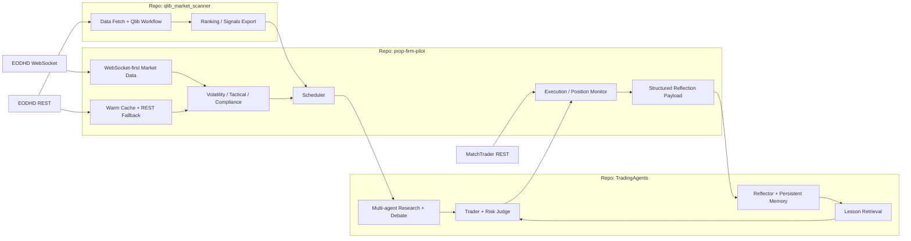
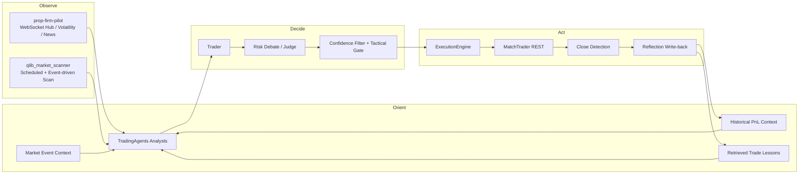
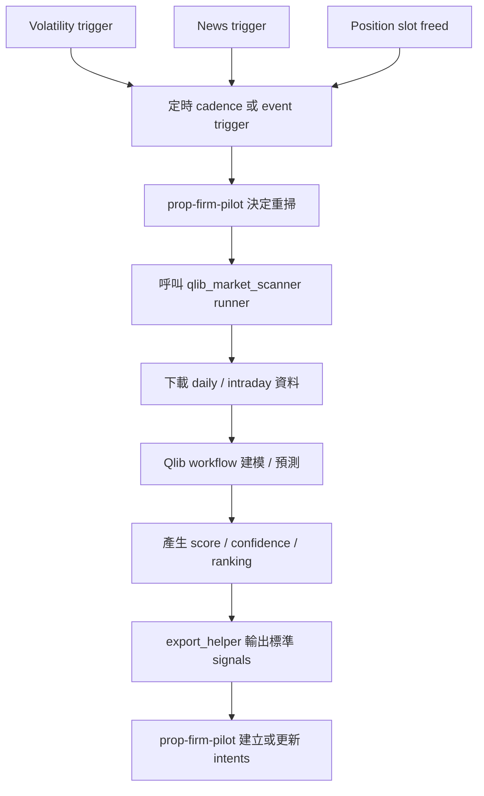
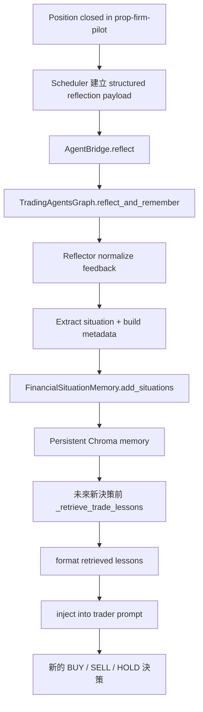
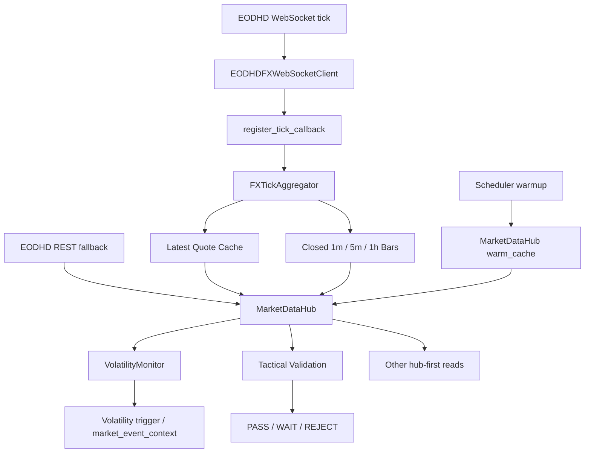
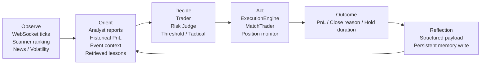
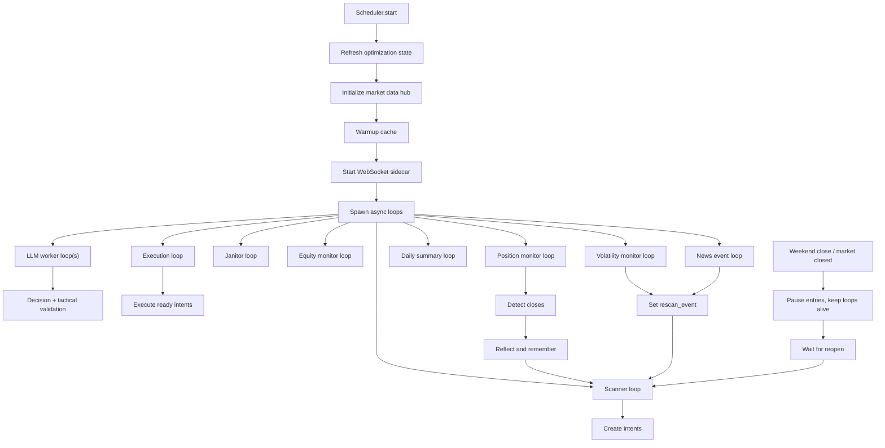
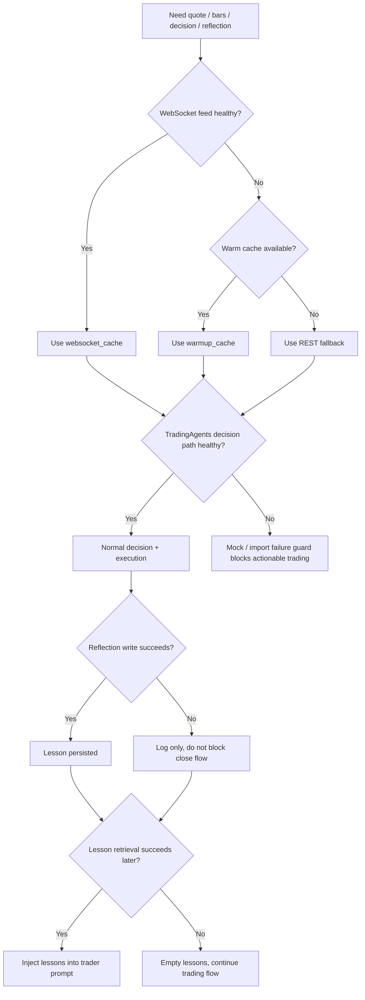

# PropFirmPilot v1.4.0 — WebSocket-First OODA Learning Loop 版本報告

> **報告日期**: 2026-03-11
> **版本**: v1.4.0（WebSocket-First Market Data + Closed-Trade Learning Loop）
> **基準版本**: v1.3.9c（P0-P2 修復完成版）
> **聚焦範圍**: (A) `prop-firm-pilot` 把 FX 觀測層升級為 WebSocket-first；(B) `TradingAgents` 建立結構化 reflection 與持久 lesson retrieval；(C) `qlib_market_scanner` 作為 OODA 上游策略掃描器在 v1.4.0 內被事件驅動地重用；(D) 三倉庫共同構成可持續運行的 24x7 自動化交易控制面

---

## 目錄

### Part A — 版本摘要與背景

1. 版本摘要
2. 版本資訊
3. 為什麼 v1.4.0 必須從 v1.3.9c 再往前走
4. 本版核心設計原則

### Part B — v1.4.0 三倉庫功能總覽

5. 三倉庫角色總覽
6. 三倉庫總架構圖
7. OODA 功能矩陣
8. v1.4.0 系統級能力總結

### Part C — `qlib_market_scanner` 在 v1.4.0 的角色與功能

9. `qlib_market_scanner` 的系統定位
10. `qlib_market_scanner` 在 v1.4.0 的有效功能
11. `qlib_market_scanner` 事件驅動重掃流程
12. `qlib_market_scanner` 輸出如何進入 OODA

### Part D — `TradingAgents` 在 v1.4.0 的角色與功能

13. `TradingAgents` 的系統定位
14. `TradingAgents` 在 v1.4.0 的新增能力
15. 結構化 reflection 與持久記憶
16. Learning Loop 流程圖
17. `TradingAgents` 的失效隔離設計

### Part E — `prop-firm-pilot` 在 v1.4.0 的角色與功能

18. `prop-firm-pilot` 的系統定位
19. WebSocket 設定面
20. WebSocket-first 行情管線
21. Scheduler、Volatility、Tactical、Reflection 串接
22. WebSocket-first Market Data Flow
23. `prop-firm-pilot` 在 v1.4.0 的功能清單

### Part F — 完整 OODA 閉環與 24x7 無間斷交易流程

24. 完整 OODA 主閉環
25. 24x7 Steady-State Runtime Flow
26. 為什麼這套 OODA 能建立有效的長時間自動交易

### Part G — fallback、安全機制、失效隔離

27. Degraded / Failure Isolation Flow
28. 安全控制與風險邊界
29. 本版對「24x7 無間斷交易」的準確定義

### Part H — 修改檔案、驗證、已知限制、後續方向

30. v1.4.0 關聯檔案清單
31. 驗證紀錄
32. 已知限制與後續方向

---

## 1. 版本摘要

v1.4.0 的核心，不是單純把某幾個 API 改成 WebSocket，也不是把某一個 prompt 微調得更聰明；它是一次跨三倉庫的**控制面升級**。

相較於 v1.3.9c，系統有兩個根本變化：

- 第一，`prop-firm-pilot` 不再把日內行情觀測主要建立在輪詢式 REST 拉取，而是升級為 **WebSocket-first + REST fallback** 的本地行情中樞。
- 第二，平倉結果不再只停留在 journal 或 PnL 報表，而是會被整理成**結構化 reflection payload**，回寫到 `TradingAgents` 的持久記憶，並在未來決策時重新被檢索與注入。

這使得 v1.4.0 的整體系統，首次同時具備以下四個層次的閉環能力：

- **Observe**: 透過 WebSocket ticks、聚合 bars、volatility/news trigger、定時 scanner，持續觀測市場。
- **Orient**: 透過 Qlib ranking、TradingAgents 多代理分析、歷史 PnL context、market event context、retrieved lessons，形成上下文。
- **Decide**: 透過 Trader/Risk Judge 決策，再疊加 tactical gate 與信心門檻。
- **Act**: 透過 MatchTrader 執行、平倉偵測、反射寫回、記憶檢索，完成下一輪決策的前饋。

因此，v1.4.0 的價值不只是更快接收價格，而是讓系統更接近一個真正能持續運轉的 OODA trading machine。

---

## 2. 版本資訊

| 項目 | 值 |
|---|---|
| 版本號 | v1.4.0 |
| 發佈日期 | 2026-03-11 |
| 基準版本 | v1.3.9c |
| 主題 | WebSocket-first Market Data + Learning Loop |
| 主倉庫 | `prop-firm-pilot` |
| 依賴倉庫 | `qlib_market_scanner`、`TradingAgents` |
| 市場資料路徑 | WebSocket-first，REST fallback retained |
| 執行路徑 | MatchTrader REST execution 維持不變 |
| 記憶路徑 | `TradingAgents` Chroma persistent memory |
| 核心目標 | 提升 Observe 即時性、降低決策失憶、建立閉環學習 |

### 跨倉庫版本視角

| 倉庫 | 在 v1.4.0 的角色 |
|---|---|
| `prop-firm-pilot` | OODA 主編排器、行情中樞、合規、執行、平倉反射來源 |
| `qlib_market_scanner` | 戰略掃描器，輸出排名、信心與候選信號 |
| `TradingAgents` | 多代理分析與決策引擎，同時承接平倉學習與 lesson retrieval |

---

## 3. 為什麼 v1.4.0 必須從 v1.3.9c 再往前走

v1.3.9c 解決了 P0 至 P2 的穩定性問題，讓系統能在 production 下不明顯失控；但它仍有兩個架構層缺口：

### 3.1 v1.3.9c 的 Observe 層仍然偏「拉取式」

在 v1.3.9c，策略層雖然已經有 scanner、volatility monitor、news trigger、tactical validation，但日內資料取得仍偏向：

- 需要時才臨時拉資料
- 各模組各自拿 quote / bars
- 快慢路徑未統一
- 缺少本地中樞來辨識 stale feed 與 fallback

這會帶來：

- 觀測延遲較高
- 同一時刻不同模組看到的行情上下文可能不同
- tactical gate 與 volatility trigger 之間缺乏統一資料源

### 3.2 決策後的得失未真正回流

在 v1.3.9c，系統已經能記錄交易日誌、優化狀態與決策輸出，但「這一筆交易最後賺還是賠、為什麼平倉、在什麼市場情境下犯錯」沒有被完整結構化地回灌到未來的 prompt。

這會造成：

- LLM 有歷史輸出，但缺乏可重檢索 lessons
- 平倉只是結束，不是新的訓練樣本
- 多代理決策容易重犯相似錯誤

### 3.3 v1.4.0 的回答

因此 v1.4.0 的回答非常明確：

- 用 **WebSocket-first market data hub** 解 Observe 層問題
- 用 **structured reflection + persistent lesson retrieval** 解 Orient/Decide 層問題
- 保持 **execution 與 fallback 的保守路徑**，不把 production 安全性賭在單一路徑上

---

## 4. 本版核心設計原則

v1.4.0 不是追求「所有東西都即時」，而是追求「該即時的地方即時，該穩定的地方穩定」。

### 4.1 WebSocket-first，不是 WebSocket-only

本版採 aggressive 方向，把市場資料主路徑提升為 WebSocket-first；但實作上仍保留：

- cold-start warmup cache
- symbol-level stale fallback
- REST historical bars fallback
- broker execution REST

這是因為 production 系統的要求是可運行，而不是純粹的技術潔癖。

### 4.2 Closed bar only

`FXTickAggregator` 只把**已收盤**的 `1m`、`5m`、`1h` bars 暴露給 downstream。這一點對 tactical 與 volatility 很重要，因為：

- 不讓半根 bar 污染 ATR / EMA / RSI 等判斷
- 不讓即時 tick noise 直接決定進場
- 把「觀測」與「可交易訊號」分離

### 4.3 Reflection failure 不得阻塞平倉

平倉是交易生命週期中的硬事件；學習是重要，但不能因為學習失敗而阻塞平倉後流程。因此：

- reflection write failure 只能記錄 log
- retrieval failure 只能退化為空 lessons
- legacy payload 仍保留相容

### 4.4 24x7 指的是控制面持續運行，不是無視市場開閉

FX 市場實際上是 24x5，不是 24x7。v1.4.0 的正確定義是：

- **系統控制面 24x7 持續運行**
- **在市場開啟時 24x5 持續交易**
- **在市場關閉時持續監控、等待、重啟、恢復、總結與準備**

---

## 5. 三倉庫角色總覽

三個倉庫在 v1.4.0 不是平行工具，而是有明確層級的流水線。

| 倉庫 | 主要責任 | 主要輸入 | 主要輸出 | OODA 階段 |
|---|---|---|---|---|
| `qlib_market_scanner` | 掃描市場、排序候選、輸出量化 signal | EODHD/歷史 OHLCV、Qlib workflow、Universe | `score`、`confidence`、`score_gap`、`topk_spread` 等 signal | Observe / Orient |
| `TradingAgents` | 多代理研究、辯論、交易決策、平倉後學習 | scanner signal、market/news/social context、reflection payload | BUY/SELL/HOLD、risk report、lessons | Orient / Decide |
| `prop-firm-pilot` | 主控排程、行情中樞、合規、執行、監控、關閉回寫 | scanner output、TradingAgents decision、WebSocket ticks、broker state | intent lifecycle、execution、trade close、reflection payload | Observe / Decide / Act |

### 三倉庫之間的關係不是「依賴安裝」，而是「系統拼裝」

- `qlib_market_scanner` 主要以 subprocess / bridge 方式被呼叫。
- `TradingAgents` 主要以動態 import 與 graph bridge 方式被調用。
- `prop-firm-pilot` 是真正持續運作的常駐 orchestrator。

---

## 6. 三倉庫總架構圖

這張圖反映了 v1.4.0 的真正重點：

- `qlib_market_scanner` 是戰略上游
- `prop-firm-pilot` 是實時控制核心
- `TradingAgents` 是決策與學習引擎

---

## 7. OODA 功能矩陣

### 7.1 OODA 矩陣表

| OODA 階段 | `qlib_market_scanner` | `TradingAgents` | `prop-firm-pilot` |
|---|---|---|---|
| Observe | 定時或重掃取得市場資料、計算排名 | 接收外部上下文，不主導行情採樣 | WebSocket ticks、warmup cache、volatility/news/quote 監測 |
| Orient | Qlib score、confidence、rank 給出量化定位 | analyst reports、historical_pnl_context、market_event_context、retrieved_trade_lessons | 準備 historical PnL context、event context、tactical data |
| Decide | 不直接下單，只輸出候選方向與置信度 | trader + risk debate 產生 BUY/SELL/HOLD | confidence filter、tactical gate、duplicate guard、compliance |
| Act | 無 | 無直接執行能力 | ExecutionEngine、MatchTrader、position close detection、reflection payload |

### 7.2 功能矩陣圖

---

## 8. v1.4.0 系統級能力總結

以系統層來看，v1.4.0 新增或強化了以下能力：

| 能力 | 具體內容 | 主要落點 |
|---|---|---|
| 即時觀測 | WebSocket tick ingestion、latest quote cache、closed bar aggregation | `prop-firm-pilot` |
| 單一行情中樞 | quote/bar 查詢統一經 `MarketDataHub` | `prop-firm-pilot` |
| 事件驅動 | volatility trigger、news trigger、rescan event | `prop-firm-pilot` + `qlib_market_scanner` |
| 戰略排序 | Qlib score / confidence / top-k spread | `qlib_market_scanner` |
| 上下文擴充 | historical pnl、market event、retrieved lessons | `prop-firm-pilot` + `TradingAgents` |
| 平倉後學習 | structured reflection payload、persistent memory metadata | `TradingAgents` |
| 再決策前檢索 | lesson query + prompt injection | `TradingAgents` |
| 失效隔離 | reflection/retrieval 不阻塞交易主流程 | `prop-firm-pilot` + `TradingAgents` |

---

## 9. `qlib_market_scanner` 的系統定位

在 v1.4.0 中，`qlib_market_scanner` 不是 live feed engine，也不是 execution engine。它的角色是：

- 在 Observe/Orient 交界處提供**戰略層 ranking**
- 在定時掃描與事件觸發下提供**候選市場清單**
- 把量化模型輸出轉成 `prop-firm-pilot` 可消化的標準訊號

這點很重要，因為 v1.4.0 的 WebSocket-first 並沒有把 `qlib_market_scanner` 改造成 streaming system；相反，v1.4.0 是把它放回它最有價值的位置：

- 負責方向與結構
- 不負責毫秒級觀測
- 被主控系統按需要喚起

---

## 10. `qlib_market_scanner` 在 v1.4.0 的有效功能

雖然 v1.4.0 的直接代碼變更不集中在 `qlib_market_scanner`，但它在系統中實際提供的功能非常關鍵，而且大多延續自 v1.3.5 以來的 intraday / Qlib 能力。

### 10.1 資料抓取與時間框架處理

`src/data/fx_fetcher.py` 在 v1.4.0 系統中持續提供：

- `fetch_daily()`：取得 daily FX OHLCV
- `fetch_intraday()`：取得 `1m` / `5m` / `1h` intraday bars
- `aggregate_to_4h()`：把 `1h` bars 聚合為 `4h`
- `download_universe_intraday()`：批量下載 intraday universe

這些能力的系統意義是：

- scanner 可維持 daily / intraday 雙時間框架
- `prop-firm-pilot` 在事件觸發重掃時可以要求 scanner 重新輸出候選
- 量化層仍然是整個 OODA 的第一個方向性過濾器

### 10.2 Runner 的 interval routing

`src/pipeline/runner.py` 提供：

- `1d` 走 daily path
- `1h` / `4h` 走 intraday path
- `4h` 經由 `1h` 下載後本地聚合

對 v1.4.0 而言，這意味著：

- scanner 可以被同一個 orchestrator 用統一方式喚起
- 策略不需要因時間框架改變而換掉整個 pipeline
- 事件觸發重掃可以針對不同 timeframe 做最小改動

### 10.3 Qlib workflow 與輸出信心

`src/pipeline/qlib_workflow.py` 持續提供：

- `1d`、`1h`、`4h` 的 label 與 workflow 相容
- `4h -> day`、`1h -> 1min` 的 Qlib freq mapping
- 模型快取與 segments 管理
- prediction / signal generation

這讓 v1.4.0 中的 scanner 不是黑盒，而是可重現、可重跑、可回測的 ranking engine。

### 10.4 Signals export helper

`src/utils/export_helper.py` 將掃描結果整理為標準 JSON，核心欄位包括：

| 欄位 | 意義 |
|---|---|
| `rank` | 候選排序 |
| `ticker` | 交易標的 |
| `score` | Qlib 分數 |
| `signal_strength` | 強弱分類 |
| `confidence` | 信心等級 |
| `score_gap` | 與下一候選的分差 |
| `drop_distance` | 與淘汰門檻距離 |
| `topk_spread` | top-k 間距 |

這些欄位會進一步被 `prop-firm-pilot` 注入 LLM、threshold filter、decision cache 與 reflection payload。

### 10.5 `qlib_market_scanner` 在 v1.4.0 的真實價值

它的價值不是「更即時」，而是「在 event-driven 架構裡持續提供高資訊密度的戰略排序」。

---

## 11. `qlib_market_scanner` 事件驅動重掃流程

這張流程圖說明：

- WebSocket 不會取代 scanner
- WebSocket 是 Observe 層的即時觀測器
- scanner 是被 Observe 層事件重新喚起的戰略評分器

---

## 12. `qlib_market_scanner` 輸出如何進入 OODA

`qlib_market_scanner` 的輸出不是直接下單，而是先進入 `prop-firm-pilot` 的 intent pipeline，再被 `TradingAgents` 消化。

### 12.1 進入 `prop-firm-pilot`

主要用途包括：

- 建立新 intent
- 做 per-symbol top-k 篩選
- 做 capacity check
- 做 duplicate symbol guard
- 做 low-confidence cooldown 與 threshold pre-filter

### 12.2 進入 `TradingAgents`

scanner 輸出的欄位會被組成 `qlib_data`，包括：

- `score`
- `signal_strength`
- `confidence`
- `score_gap`
- `drop_distance`
- `topk_spread`

v1.4.0 再在這個 `qlib_data` 上疊加：

- `historical_pnl_context`
- `market_event_context`
- `retrieved_trade_lessons`

因此，`qlib_market_scanner` 在 v1.4.0 中是 OODA 的「第一層定向器」。

---

## 13. `TradingAgents` 的系統定位

`TradingAgents` 在 v1.4.0 中的角色，不只是輸出 BUY/SELL/HOLD，而是承擔以下責任：

- 把量化 signal 與多源上下文整合成可推理的狀態
- 用多代理研究、辯論、交易員判斷與風險裁決形成決策
- 在平倉後吸收成敗，整理 lessons，寫回持久記憶
- 在未來決策前檢索相似 lessons，避免重複犯錯

簡單說：

- `qlib_market_scanner` 告訴系統「值得看哪裡」
- `TradingAgents` 告訴系統「這次應該怎麼理解」
- `prop-firm-pilot` 決定「什麼時候真的執行」

---

## 14. `TradingAgents` 在 v1.4.0 的新增能力

v1.4.0 在 `TradingAgents` 主要不是新增新的 analyst 類型，而是把決策狀態、平倉反射與 lesson retrieval 串起來。

### 14.1 Agent state 擴充

`tradingagents/agents/utils/agent_states.py` 新增了三個重要欄位：

| 欄位 | 來源 | 用途 |
|---|---|---|
| `historical_pnl_context` | `prop-firm-pilot` scheduler | 把近 7 日已實現績效摘要帶進來 |
| `market_event_context` | volatility/news trigger | 把最新市場事件摘要帶進來 |
| `retrieved_trade_lessons` | lesson retrieval | 把歷史相似交易教訓帶進 trader prompt |

這三個欄位使 `TradingAgents` 的狀態從「只看當下信號」升級為「帶有近期績效、事件背景、歷史教訓的上下文狀態」。

### 14.2 Propagator 會保留這些欄位

`tradingagents/graph/propagation.py` 的 `create_initial_state()` 會把上述欄位寫進 graph 初始 state。這讓後續每個 agent node 都能共享同一份高階上下文。

### 14.3 Trader prompt 顯式引用 lessons

`tradingagents/agents/trader/trader.py` 在 v1.4.0 會把以下內容顯式拼進 trader prompt：

- `Quantitative Analysis (Qlib)`
- `Historical PnL Context`
- `Fresh Market Event Context`
- `Retrieved Trade Lessons`

這是 v1.4.0 的核心差異之一，因為它把「過去平倉學到的教訓」從隱性記憶，變成明確輸入。

### 14.4 既有 trader memory 與新 retrieval 雙軌並行

Trader node 本身仍會根據當前情境向 `trader_memory` 查詢 past memories；v1.4.0 新增的 `retrieved_trade_lessons` 則是 graph 在 propagate 前預先檢索的 lessons。這形成雙軌：

- 一條是 trader 依當前摘要自行找 past memories
- 一條是系統根據 symbol / pnl context / event context 主動灌入 lessons

---

## 15. 結構化 reflection 與持久記憶

這是 `TradingAgents` 在 v1.4.0 最重要的升級。

### 15.1 Reflection 接受 structured payload

`tradingagents/graph/reflection.py` 的 `_normalize_feedback()` 會同時接受兩種格式：

- legacy: `{symbol: pnl}`
- structured: 帶有 `symbol`、`realized_pnl`、`close_reason`、`risk_report`、`historical_pnl_context` 等欄位的 payload

這代表：

- 舊路徑仍可用
- 新路徑可以保存完整語境

### 15.2 Reflection 會抽出完整「情境」

`_extract_current_situation()` 會從 payload 與 current state 收集：

- symbol
- trade date
- side
- decision summary
- realized pnl
- close reason
- historical pnl context
- market event context
- risk report
- market / sentiment / news / fundamentals / options / institutional reports

結果不是只記「賺 30 美元」，而是記「在什麼情況下賺或賠」。

### 15.3 Metadata 也會持久保存

`_build_memory_metadata()` 會把以下資訊跟著 lesson 一起存進 memory：

- `component`
- `feedback_mode`
- `symbol`
- `trade_date`
- `closed_at`
- `position_id`
- `side`
- `realized_pnl`
- `close_reason`
- `resolution_path`
- `hold_duration_seconds`
- `scanner_score`
- `scanner_confidence`
- `historical_pnl_context`
- `market_event_context`
- `risk_report`
- `model_id`

這使 v1.4.0 的 lesson memory 不只是文本庫，而是帶 metadata 的結構化案例庫。

### 15.4 Memory 寫入為 persistent Chroma collection

`tradingagents/agents/utils/memory.py` 的 `FinancialSituationMemory` 會：

- 使用 persistent Chroma client
- 對長文本分塊後 embedding
- 存入 `documents + metadatas + embeddings + ids`
- 在 query 時回傳 recommendation、matched situation、similarity score 與 metadata

這代表 lessons 不會隨進程結束而消失，而是變成跨 session 的可檢索記憶。

### 15.5 Lesson retrieval query 是結構化生成的

`tradingagents/graph/trading_graph.py` 的 `_build_trade_lesson_query()` 會把以下資訊組成查詢：

- `Symbol`
- `Historical PnL Context`
- `Fresh Market Event Context`
- `Signal Snapshot`

也就是說，未來查 lesson 不是靠空泛語意，而是用 symbol + 績效背景 + 市場事件 + 當前量化快照去查詢相似案例。

### 15.6 Retrieval 結果會再格式化成 prompt block

`_format_retrieved_trade_lessons()` 會把查回來的記憶整理為帶註記的編號列表，附上：

- symbol
- trade_date
- close_reason
- realized_pnl

這有助於 LLM 把 lesson 視為可操作的經驗，而不是抽象片語。

---

## 16. Learning Loop 流程圖

這張圖就是 v1.4.0 的核心閉環之一：

- 交易結果不再只是結果
- 交易結果會被轉化為下一輪決策前的偏差修正資訊

---

## 17. `TradingAgents` 的失效隔離設計

在 production 環境，學習機制必須服從交易主流程，所以 v1.4.0 特別把失效隔離做清楚。

| 失效情境 | 行為 |
|---|---|
| `reflect_and_remember` 不存在 | `AgentBridge` 記 warning，直接返回 |
| reflection 寫入失敗 | 記 error，不阻塞 scheduler 平倉流程 |
| lesson retrieval query 失敗 | 回傳空字串，不阻塞決策 |
| memory embedding / query 失敗 | trader 仍可用沒有 lesson 的 prompt 做決策 |
| legacy payload 傳入 | 仍可正常 reflection |

這使 `TradingAgents` 的 learning loop 是**增益功能**，不是單點失效來源。

---

## 18. `prop-firm-pilot` 的系統定位

`prop-firm-pilot` 是 v1.4.0 唯一真正持續常駐、掌握交易生命週期全貌的主系統。

它同時承擔：

- 排程器
- 合規守門員
- 市場資料中樞
- 意圖生命周期管理器
- 執行與平倉監視器
- 反射資料的來源端

如果把三倉庫看成一台機器：

- `qlib_market_scanner` 是眼睛中的遠距聚焦鏡
- `TradingAgents` 是大腦中的推理區
- `prop-firm-pilot` 是神經系統加脊髓，負責把訊號真正送到手腳

---

## 19. WebSocket 設定面

v1.4.0 在 `src/config.py` 新增 `WebSocketConfig`，主要欄位如下：

| 欄位 | 作用 |
|---|---|
| `enabled` | 是否啟用 WebSocket 市場資料 |
| `use_as_primary_market_data` | 宣告以 WebSocket 作為主行情來源 |
| `provider` | 目前固定 `eodhd` |
| `symbols` | 訂閱標的清單 |
| `reconnect_base_seconds` | 指數退避起點 |
| `reconnect_max_seconds` | 指數退避上限 |
| `stale_after_seconds` | 幾秒無 tick 視為 stale |
| `quote_ttl_seconds` | quote 多久內視為 fresh |
| `warmup_1m_bars` | 1m bars 取用窗口 |
| `warmup_5m_bars` | 5m bars 取用窗口 |
| `warmup_1h_bars` | 1h bars 取用窗口 |

### 19.1 這些設定的實際意義

- `enabled` 決定 scheduler 啟動時是否初始化 market data hub
- `stale_after_seconds` 與 `quote_ttl_seconds` 共同決定是否要 fallback
- `warmup_*_bars` 讓 tactical / downstream consumer 可以用固定視窗取 closed bars

### 19.2 `use_as_primary_market_data` 的語義

目前實際 primary path 是由 scheduler 初始化 `MarketDataHub` 後自然走 WebSocket-first；`use_as_primary_market_data` 是配置層對系統意圖的顯式宣告，方便未來擴展與環境切換。

---

## 20. WebSocket-first 行情管線

v1.4.0 在 `prop-firm-pilot` 新增了三個關鍵元件：

| 模組 | 作用 | 關鍵能力 |
|---|---|---|
| `src/data/fx_websocket_client.py` | 接 EODHD FX WebSocket | tick parse、callback dispatch、reconnect、stale tracking |
| `src/data/fx_tick_aggregator.py` | 從 tick 建本地行情快取 | latest quote、closed `1m/5m/1h` bars |
| `src/data/market_data_hub.py` | 統一讀取行情 | `websocket_cache`、`warmup_cache`、`rest_fallback` |

### 20.1 `EODHDFXWebSocketClient`

它做的事情包括：

- 連接 `wss://ws.eodhistoricaldata.com/ws/forex`
- 發送 subscribe payload
- 將 provider payload 解析為 `WebSocketTick`
- 保存每個 symbol 的最新 tick
- 追蹤最後訊息時間與 stale symbols
- 在斷線時用 bounded exponential backoff 重連

這代表 v1.4.0 的 Observe 層第一次具備：

- 持續連接
- symbol freshness 感知
- callback-based tick fanout

### 20.2 `FXTickAggregator`

它把 tick 轉成兩種更穩定的資料形態：

- 最新 quote snapshot
- 已收盤的 `1m`、`5m`、`1h` bars

其設計重點：

- 每個 tick 先更新 latest quote
- `1m` bucket 到時關閉後，再 roll up 成 `5m` / `1h`
- downstream 只讀 closed bars

### 20.3 `MarketDataHub`

`MarketDataHub` 是 v1.4.0 的 Observe 核心，它統一了三種來源：

- `websocket_cache`
- `warmup_cache`
- `rest_fallback`

#### Quote 解析邏輯

1. 若 symbol 未被強制標 stale，優先看 aggregator latest quote
2. 若 tick 新鮮，回傳 `websocket_cache`
3. 否則抓 REST `1m` bars，取最後 close 模擬 quote，標記 `rest_fallback`

#### Bars 解析邏輯

1. 優先取 websocket-derived closed bars
2. 若 bars 新鮮，回傳 `websocket_cache`
3. 否則看 warm cache
4. 再不行才打 REST fallback

這讓 volatility monitor 與 tactical validator 從「各自找資料」變成「統一向 hub 取資料」。

---

## 21. Scheduler、Volatility、Tactical、Reflection 串接

v1.4.0 的真正改變，不在單一模組，而在 `Scheduler` 把它們全部接起來。

### 21.1 啟動流程

`Scheduler.start()` 會先：

- refresh optimization state
- `_initialize_market_data_hub()`
- warmup recent intraday bars
- 啟動 WebSocket sidecar task
- 將 hub 注入 volatility monitor

然後再啟動長駐 loops：

- scanner loop
- execution loop
- janitor loop
- equity monitor loop
- position monitor loop
- daily summary loop
- LLM worker loops
- volatility monitor loop
- news event loop

### 21.2 Volatility monitor 改為 hub-first

`src/scheduler/volatility_monitor.py` 在 v1.4.0 支援直接從 `MarketDataHub` 取 quote：

- 若 hub 可用，直接走 `get_quote()`
- 記錄 quote source
- 用 rolling window 算 price change %
- 達 threshold 時設置 rescan event 與 market event context

這表示 volatility trigger 不再必須先去 broker quote，能更直接利用本地即時快取。

### 21.3 Tactical validation 改為 hub-first

`Scheduler._fetch_tactical_data()` 的流程是：

1. 先向 `MarketDataHub` 取 quote、`5m` bars、`1h` bars
2. 若 hub 有資料，填入 `quote_source`、`bars_5min_source`、`bars_1h_source`
3. 若 hub 失敗，再退回 MatchTrader quote + EODHD REST bars

這有三個重要結果：

- tactical gate 優先使用本地 closed bars
- 每次評估都能知道資料來源是 `websocket_cache`、`warmup_cache` 還是 `rest_fallback`
- live 觀測與 tactical 驗證之間的資料不再各自為政

### 21.4 Structured reflection payload 由 scheduler 建立

`Scheduler._build_reflection_payload()` 會產生完整 payload，欄位包括：

| 欄位 | 說明 |
|---|---|
| `symbol` | 交易標的 |
| `trade_date` | 建議/交易日期 |
| `closed_at` | 平倉時間 |
| `position_id` | 倉位 ID |
| `side` | 方向 |
| `realized_pnl` | 已實現盈虧 |
| `close_reason` | 平倉原因 |
| `resolution_path` | 關閉路徑 |
| `hold_duration_seconds` | 持倉秒數 |
| `scanner_score` | scanner 分數 |
| `scanner_confidence` | scanner 信心 |
| `historical_pnl_context` | 當時的 PnL 摘要 |
| `market_event_context` | 當時的事件上下文 |
| `decision_summary` | 決策摘要 |
| `risk_report` | risk report |
| `model_id` | 當次模型 |
| `final_state` | TradingAgents 最終狀態 |

這個 payload 是 v1.4.0 把 Act 回流到 Orient 的核心介面。

---

## 22. WebSocket-first Market Data Flow

這張圖有三個重點：

- WebSocket 負責即時增量
- warmup cache 解 cold-start
- REST fallback 解 stale / missing / degraded 情境

---

## 23. `prop-firm-pilot` 在 v1.4.0 的功能清單

以下是 `prop-firm-pilot` 在 v1.4.0 的主要功能點。

### 23.1 行情層

- 啟用 WebSocket-first FX feed
- tick 聚合為 closed `1m/5m/1h` bars
- 建立 market data hub
- 提供 symbol freshness 與 feed status

### 23.2 決策上下文層

- 在 LLM 前組裝 `qlib_data`
- 注入 `historical_pnl_context`
- 注入 `market_event_context`
- 讓 `TradingAgents` 再自行補 `retrieved_trade_lessons`

### 23.3 驗證層

- confidence threshold pre-filter / post-filter
- tactical gate hub-first data fetch
- duplicate active-position guard
- same-direction-per-day limit
- low-confidence cooldown

### 23.4 執行與平倉層

- 維持 MatchTrader execution path
- position monitor 偵測 closed positions
- 根據 close result 產生 structured reflection payload
- 呼叫 `AgentBridge.reflect()` 回寫 lessons

### 23.5 長駐控制面

- scanner / llm / execution / janitor / equity / position / summary 多 loop 並行
- market hours pause / reopen
- volatility / news event driven rescan
- degraded 時退回 REST，不中斷主排程

---

## 24. 完整 OODA 主閉環

這條閉環在 v1.4.0 之前並不完整，因為：

- Observe 不夠即時
- Outcome 沒有結構化回流
- Lessons 沒有在下一輪前顯式注入

到了 v1.4.0，這三個缺口首次同時被補上。

---

## 25. 24x7 Steady-State Runtime Flow

這張圖對「無間斷」的定義很關鍵：

- loop 不停
- market closed 時也不退出
- reopen 後直接恢復 Observe -> Decide -> Act

---

## 26. 為什麼這套 OODA 能建立有效的長時間自動交易

有效，不只是「一直跑」；有效是指在長時間運行下，系統仍能維持資訊品質、決策品質與安全邊界。

### 26.1 Observe 更快且更一致

v1.4.0 以前，不同模組可能各自向不同來源拉取資料。現在：

- live quote 與 intraday bars 優先從同一個 hub 來
- volatility 與 tactical 對市場的理解更一致
- stale / fallback 行為有單一治理點

### 26.2 Orient 不再失憶

加入：

- historical pnl context
- fresh market event context
- retrieved trade lessons

之後，`TradingAgents` 的判斷不再只是當下 signal + 當下 analyst reports，而是帶著近期績效與相似錯誤樣本一起推理。

### 26.3 Decide 多了可解釋的第二層門

決策不是單純讓 LLM 說 BUY/SELL/HOLD，而是還要通過：

- threshold filter
- tactical validator
- duplicate guards
- compliance / best day / drawdown 邊界

### 26.4 Act 不再把平倉當終點

平倉後，系統會：

- 紀錄 close reason
- 計算 realized pnl
- 組裝 reflection payload
- 將 lesson 寫回 memory

也就是說，Act 的輸出會變成下一輪 Orient 的輸入。這就是有效閉環。

---

## 27. Degraded / Failure Isolation Flow

這張圖表達的是 v1.4.0 的哲學：

- 市場資料可以降級
- 學習功能可以降級
- 但主交易控制面不能因為附屬功能失敗而整體停機

---

## 28. 安全控制與風險邊界

除了新架構外，v1.4.0 仍站在 v1.3.9c 的安全基礎上運作。這些機制共同保證它不會因為「更自動化」而變得更危險。

| 風險 | 控制點 |
|---|---|
| 日內資料 stale | `stale_after_seconds`、`quote_ttl_seconds`、REST fallback |
| 半根 bar 噪音 | aggregator 僅輸出 closed bars |
| 重覆開倉 | active-position guard、intent dedup |
| 過度交易 | `max_positions`、same-direction daily limit |
| 低品質信號 | confidence pre/post filter、low-confidence cooldown |
| 差的進場 timing | tactical hard/soft gates |
| prop-firm 規則違反 | daily drawdown、max drawdown、best day tracker、equity monitor |
| mock LLM 或 import failure | block actionable trading |
| reflection/retrieval 失敗 | log only / empty lessons，不阻塞交易主流程 |

### 28.1 合規沒有因 v1.4.0 被弱化

雖然 v1.4.0 引入了更多自動化，但並沒有削弱既有 safety-critical 保護：

- drawdown guards 仍在
- best day rule 仍在
- market hours / weekend pause 仍在
- equity monitor 仍在

也就是說，本版是「更快的 Observe + 更完整的 Learn」，不是「更冒進的風控」。

---

## 29. 本版對「24x7 無間斷交易」的準確定義

這一點需要說清楚。

### 29.1 控制面是 24x7

`Scheduler`、WebSocket sidecar、monitor loops、janitor、summary、memory flow 都可以持續常駐，不必每天人工啟動。

### 29.2 實際交易窗口是 24x5

FX 市場有週末休市，因此：

- 系統不能在市場關閉時硬做成交
- market hours checker 會在關閉時暫停新進場
- 但整個控制面仍保持在線，等待 reopen

### 29.3 「無間斷」的真正含義

在本專案裡，「24x7 無間斷交易」更準確地說是：

- **24x7 無人工中斷的自動化交易控制面**
- **24x5 無需人工接手的持續交易執行能力**

這是 production 語義上正確、也是對 prop firm 規則負責的說法。

---

## 30. v1.4.0 關聯檔案清單

### 30.1 `prop-firm-pilot` 直接實作檔案

| 類型 | 檔案 |
|---|---|
| 設定 | `src/config.py` |
| WebSocket client | `src/data/fx_websocket_client.py` |
| Tick aggregation | `src/data/fx_tick_aggregator.py` |
| Market data hub | `src/data/market_data_hub.py` |
| 主排程 | `src/scheduler/scheduler.py` |
| volatility hub-first | `src/scheduler/volatility_monitor.py` |
| tactical gate | `src/decision/tactical_validator.py` |
| TradingAgents bridge | `src/decision/agent_bridge.py` |

### 30.2 `TradingAgents` 直接實作檔案

| 類型 | 檔案 |
|---|---|
| Graph 主控 | `tradingagents/graph/trading_graph.py` |
| Reflection | `tradingagents/graph/reflection.py` |
| State propagation | `tradingagents/graph/propagation.py` |
| Agent state | `tradingagents/agents/utils/agent_states.py` |
| Persistent memory | `tradingagents/agents/utils/memory.py` |
| Trader prompt | `tradingagents/agents/trader/trader.py` |

### 30.3 `qlib_market_scanner` 在 v1.4.0 中被依賴的關鍵檔案

| 類型 | 檔案 |
|---|---|
| Runner | `src/pipeline/runner.py` |
| FX fetcher | `src/data/fx_fetcher.py` |
| Qlib workflow | `src/pipeline/qlib_workflow.py` |
| Signals export | `src/utils/export_helper.py` |

### 30.4 說明

上表第三組是「v1.4.0 依賴使用的關鍵檔案」，不等同於本次 release 一定直接修改過的檔案；但這些檔案共同構成了 v1.4.0 實際運行所依賴的上游能力。

---

## 31. 驗證紀錄

以下為 v1.4.0 release 記錄中的驗證結果：

| 驗證項目 | 結果 |
|---|---|
| `prop-firm-pilot` targeted suites | `188 passed` |
| `TradingAgents` targeted suites | `6 passed` |
| `v1.3.9c` regression set | `214 passed` |
| `prop-firm-pilot` lint | `All checks passed!` |
| `TradingAgents` changed-file lint | `All checks passed!` |

### 31.1 驗證範圍說明

- `prop-firm-pilot` 驗證集中於 config、websocket client、tick aggregator、market data hub、volatility monitor、tactical validator、scheduler、agent bridge 等 v1.4.0 關聯模組。
- `TradingAgents` 驗證集中於 memory reflection 與 prompt memory injection。
- `TradingAgents` full-repo lint 不是本次 release gate，因該 repo 尚有與本版無關的既有 lint debt。

---

## 32. 已知限制與後續方向

v1.4.0 已把系統推進到一個明顯更成熟的狀態，但仍有清楚邊界。

### 32.1 已知限制

- WebSocket-first 目前聚焦在 market data path，broker execution 仍維持 REST。
- `retrieved_trade_lessons` 目前主注入點是 trader prompt，尚未完全擴散到 bull / bear / judge prompt。
- `qlib_market_scanner` 仍是 event-driven strategic scanner，不是 streaming alpha engine。
- REST fallback 的即時性不等同於 live tick feed。
- warmup 視窗與 hub 內部 lookback 邏輯仍可再進一步對齊與參數化。

### 32.2 後續方向

- 把 lesson retrieval 擴展到更多 agent node
- 將 market data hub status 做成更清晰的 ops observability 輸出
- 視需要擴充到更多 WebSocket-aware downstream consumer
- 進一步縮短 observe -> rescan -> decide 的事件傳播延遲

### 32.3 本版總結

v1.4.0 的真正成果，是把三個原本各自有價值的倉庫，拼成了一個更像真實自動交易系統的閉環：

- `qlib_market_scanner` 給方向
- `TradingAgents` 給理解與修正
- `prop-firm-pilot` 給持續運行、執行與風控

而 WebSocket-first Observe 與 structured learning loop，正是讓這個閉環從「能跑」升級到「能長時間有效運作」的關鍵。
